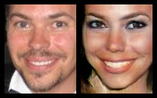

# deep-makeover

The purpose of this deep-learning project is to show that it's possible to automatically transform pictures of faces in useful and fun ways. The way this is done is by filtering the type of faces used as inputs to the model and the types of faces used as the desired target. The exact same architecture can be used to transform masculine faces into feminine ones, or vice versa, just by switching the source and target images used during training.

Here are two examples of this in action:

Please note the male-to-female example is my former boss [Benj Lipchak](http://www.charitocracy.org). Used with permission.

Each of these two examples were made after training a model for just two hours on one GTX 1080 GPU.

It also has other potential applications, such as vanity filters that make people look more attractive. This would be done by selecting only attractive faces as the target population. More experimentation will be required.

# How it works

The network architecture is essentially a conditioned DCGAN where the generator is actually composed of two parts: an encoder and a decoder. The encoder transforms the input image into a lower-dimensional latent representation, and the decoder transforms that latent representation back to an RGB image of the same dimensions as the network's input. Both the generator and discriminator are resnets.

For details see function `create_model()` in file `dm_model.py`.

# Key takeaways from this project

Here is what I learned in this project. I can't claim these are original ideas, just my personal observations.

## Tune the architecture to the nature of the problem

This project takes 80x100 pixel images as inputs and produces images of the same size as outputs. In addition to that both of those images are faces, which means that the input and output distributions are very similar.

GANs often start from an arbitrary multidimensional distribution Z which is progressively shaped into an image. It would be possible to do the same in this project by progressively encoding the 80x100 pixel input image into a 1x1 latent embedding and later expanding it to an image again. However, since we know that the input and output distributions are very similar we don't need to encode the input image all the way down into 1x1 pixels.

In the final architecture the encoder only has two pooling layers. Increasing the number of layers actually lowered the quality of the outputs in the sense that they no longer resembled the person in the source image. The goal was to produce an output that was clearly recognizable as the same person, and that necessarily requires making relatively small changes to the source material.

## Resnets do best with a custom initialization

Xavier Glorot's type of initialization makes sense when your network lacks skip connections, but in a resnet it makes more sense to initialize the weights with very small values centered around zero so that the composite function they compute is not far from the identity.  For the projection layers, which can't be residual, we initialized the weights as to approximate the identity function.

This type of initialization definitely makes sense for networks that transform images into images, as the initial network prior to any training will compute a reasonable first approximation: the identity.

## Consider annealing the loss function

A good loss function for this model has two competing elements. On the one hand it is desirable that the output image is similar to the input image on a pixel basis (either MSE or L1 distance). On the other hand it is also desirable to allow the generator to be strongly influenced by the discriminator in order to avoid the blurriness that comes from a pixel-distance-based loss. Additionally GANs often fail to converge early on when the discriminator has no idea of what a plausible sample looks like.

What we did in this project was to modify the loss function over time. At the very beginning the generator completely ignores the gradients coming from the discriminator and instead only uses an pixel-based L1 loss. Over time as the discriminator becomes more discerning the importance of the adversarial loss increases.

## A smaller dataset can be better

I initially assumed that a larger dataset would be better, and as a consequence I did no cleanup or filtering of the dataset. To put it bluntly, there are only a few ways to be handsome, but many different ways to be ugly. This means that if you select only faces labeled as 'attractive=true' in the dataset, the network converges more quickly, as attractive faces are a narrower target distribution. This is the same reason why I also filtered out people with glasses and sunglasses.

# Requirements

You will need Python 3.5+ with Tensorflow r0.12+, and reasonably recent versions of numpy and scipy.

## Dataset

After you have the required software above you will also need the `Large-scale CelebFaces Attributes (CelebA) Dataset`. The model expects the `Align&Cropped Images` version. Extract all images to a subfolder named `dataset`. I.e. `deep-makeover/dataset/lotsoffiles.jpg`.

# Training the model

Training with default settings: `python3 dm_main.py --run train`. The script will periodically output an example batch in PNG format onto the `train` folder, and checkpoint data will be stored in the `checkpoint` folder.

# About the author

[LinkedIn profile of David Garcia](https://ca.linkedin.com/in/david-garcia-70913311).
